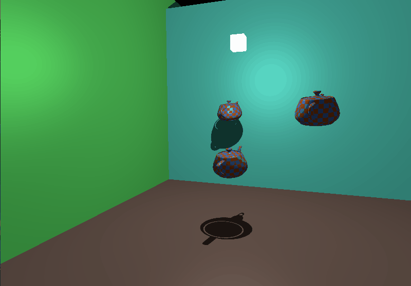

# SPINNY

Simple scene made as an excersise in CG.
Managed to implement things such as:
- wavefront obj and mtl loading
- texture mapping 
- blinn-phong shading model
- shadow mapping for point lights

use WASD to move and mouse to look around

# Running this
Wgpu and winit are cross platform so it should work out of the box with just `cargo run`
If anything checkout requirements for the above mentioned packages  
Add a wavefront obj to `/assets/mode.obj` also include a corresponding mtl file there. In the demo gif I used the Utah teapot

